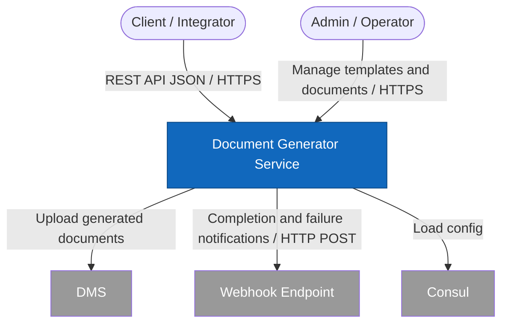

# C1 — System Context Diagram

The context diagram shows the **Document Generator Service** and its interactions with actors and external systems.

## Diagram

> **Note:** An earlier version used `C4Context`, which requires [Mermaid C4 diagrams](https://mermaid.js.org/syntax/c4.html) (v9.3+). Cursor and many Markdown previews do **not** enable C4 by default, which causes **"Mermaid Syntax Error"**. Standard `flowchart` is used here for compatibility.

## Description

| Element | Role |
|---------|------|
| **Client / Integrator** | Calls the API to create generation jobs (`request_id` as idempotency key), check status, download files. |
| **Admin / Operator** | Creates templates, versions, publishes schemas, monitors render logs & callback attempts. |
| **Document Generator Service** | Core system: payload validation, job queueing, rendering, metadata & file storage. |
| **DMS** | Optional; enabled per request (`store_to_dms`). |
| **Webhook Endpoint** | Optional; callback after document is `GENERATED` or on failure. |
| **Consul** | Optional; configuration source besides local files / env vars. |

## System Boundaries

- Multi-tenant via `X-Tenant-Id` header.
- Authentication assumed as Bearer JWT (see OpenAPI `bearerAuth`).
- Document generation is **asynchronous**; clients poll status or receive webhooks.

## Why `C4Context` failed

| Cause | Detail |
|-------|--------|
| **Unsupported diagram type** | `C4Context` / `C4Container` / `C4Component` are C4-specific; built-in Mermaid in Cursor/VS Code often only supports `flowchart`, `sequenceDiagram`, `classDiagram`, etc. |
| **Special characters** | Em dash `—` in `title`, colons `:` in descriptions, and `&` in labels can break parsers even when C4 is enabled. |
| **Fix** | Use standard `flowchart` (above), or render on [mermaid.live](https://mermaid.live) with C4 support enabled. |
