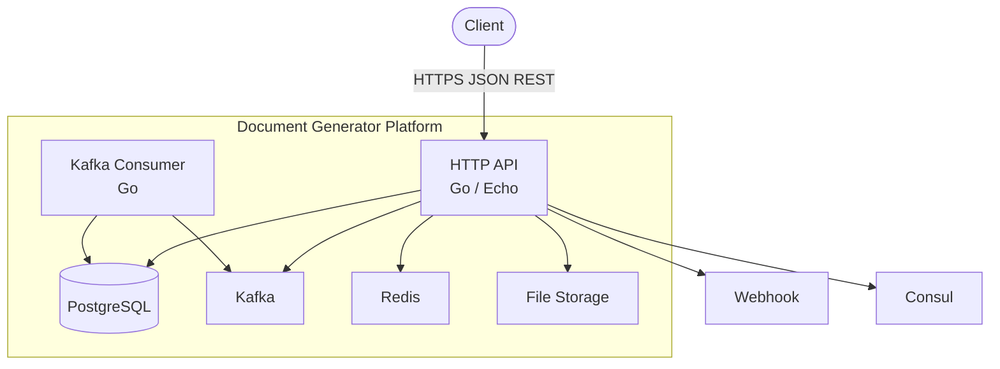
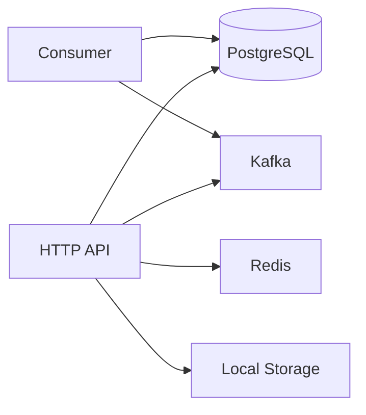

# C2 — Container Diagram

The container diagram breaks the system into **deployable units** and supporting infrastructure.

## Diagram

## Containers

| Container | Entrypoint | Responsibility |
|-----------|------------|----------------|
| **HTTP API** | `cmd/app/main.go` → `bootstrap.RunApp()` | Echo routing, DI wiring, graceful shutdown. |
| **Kafka Consumer** | `cmd/consumer/main.go` → `bootstrap.RunConsumer()` | Processes Kafka topics (e.g. user/order). |
| **PostgreSQL** | `database/*.sql` | Schema: `document_templates`, `document_template_versions`, `documents`, `document_render_logs`, `document_callback_attempts`. |
| **Kafka** | `configs/config.yaml` | Topics: `document-events`, `template-events`, `user-events`. |
| **Redis** | `internal/bootstrap/redis.go` | Redis client (ready for cache/rate-limit). |
| **File Storage** | `internal/shared/storage/local.go` | Stores rendered file bytes (PDF/HTML/etc.). |

## Runtime Dependencies

## Ports & Configuration

| Service | Default |
|---------|---------|
| HTTP API | `:8080` |
| PostgreSQL | `:5432` |
| Kafka | `:9092` |
| Redis | `:6379` |

See [`configs/config.yaml`](../../configs/config.yaml) and [`docker-compose.yml`](../../docker-compose.yml).
