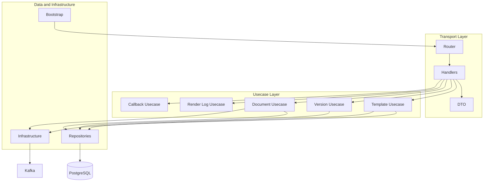
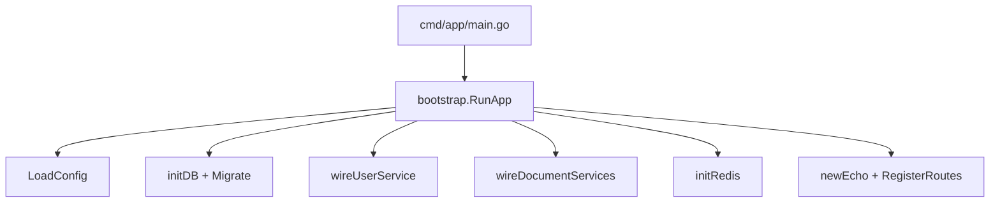

# C3 — Component Diagram (HTTP API)

Components inside the **HTTP API** container follow Clean Architecture.

## Diagram

## Endpoint → Handler → Usecase

| API Group | Handler | Usecase |
|-----------|---------|---------|
| `/templates` | `TemplateHandler` | `documenttemplates.Service` |
| `/templates/:id/versions` | `TemplateVersionHandler` | `documenttemplateversions.Service` |
| `/documents` | `DocumentHandler` | `documents.Service` |
| `/documents/:id/render-logs` | `DocumentHandler` | `documentrenderlogs.Service` |
| `/callbacks/test` | `CallbackHandler` | `documentcallbackattempts.Service` |
| `/users` | `UserHandler` | `users.UserService` (example) |

## Bootstrap Wiring

