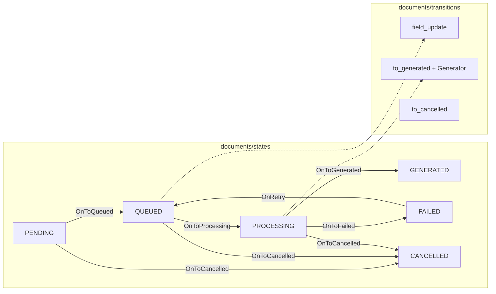
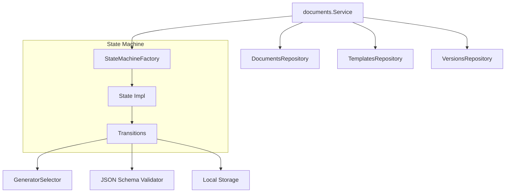
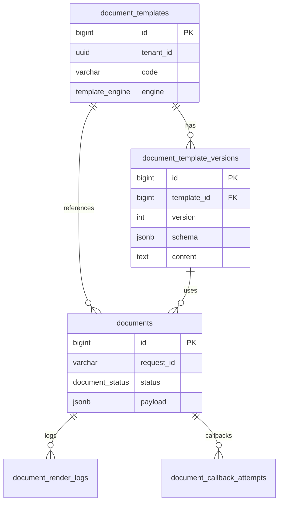

# C3 — Component Diagram (Domain & State Machine)

Focus on the **documents** domain and the state machine pattern (similar to `usecase/sample`).

## State Machine Diagram

## Domain Component Diagram

## Packages & Responsibilities

| Package | Pattern | Purpose |
|---------|---------|---------|
| `entity/` | Domain model | Pure structs + enums |
| `repository/` | Repository | Interface + `postgres/` + `model/` |
| `usecase/*/events.go` | Publisher interface | Kafka per domain (separate files) |
| `usecase/documents/states/` | State Machine | Factory + state per status |
| `usecase/documents/transitions/` | Command handlers | Side effects per transition |
| `usecase/documents/statemachine_wire.go` | Composition root | Wire handlers (avoids import cycles) |
| `infrastructure/documents/` | Adapter | `Selector` → PDF/HTML/CSV generator |

## Entity & Tables

