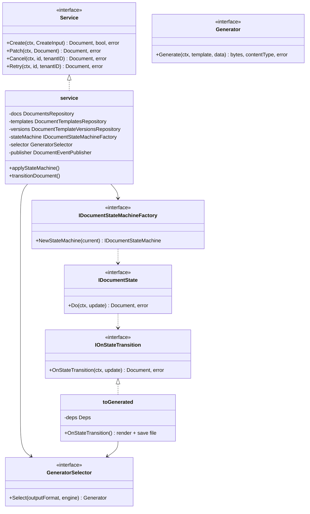
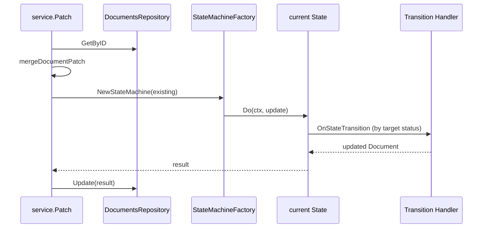

# C4 — Code Diagram (Documents Usecase)

Code level: main interfaces/classes in the `documents` package and its dependencies.

## Class Diagram (Documents)



## File Map

```
internal/usecase/documents/
├── service.go              # Service interface + Create, List, Cancel, Retry
├── patch.go                # applyStateMachine, transitionDocument
├── routing.go              # Generator, GeneratorSelector interfaces
├── events.go               # DocumentEventPublisher
├── statemachine_wire.go    # BuildStateHandlers (wiring)
├── selector_adapter.go     # Adapter GeneratorSelector → transitions
├── states/
│   ├── state.go            # Factory, Handlers, interfaces
│   ├── pending.go          # → QUEUED | CANCELLED | field update
│   ├── queued.go           # → PROCESSING | CANCELLED | field update
│   ├── processing.go       # → GENERATED | FAILED | CANCELLED
│   ├── generated.go        # terminal
│   ├── failed.go           # → QUEUED (retry)
│   └── cancelled.go        # terminal
└── transitions/
    ├── deps.go
    ├── field_update.go     # JSON Schema validation
    ├── to_generated.go     # generateAndFinalize()
    ├── to_queued.go
    ├── to_processing.go
    ├── to_cancelled.go
    ├── to_failed.go
    └── retry.go
```

## Internal Sequence: Patch + State Machine



## Generator Infrastructure

| Output | Engine | Implementation |
|--------|--------|----------------|
| PDF | HTML template | `infrastructure/documents/pdf` (wkhtmltopdf) |
| HTML | HTML | `infrastructure/documents/html` |
| CSV / default | HANDLEBARS/MUSTACHE | `infrastructure/documents/csv` (text/template) |

Selector: `infrastructure/documents/factory.go` → `usecase/documents.GeneratorSelector`.
