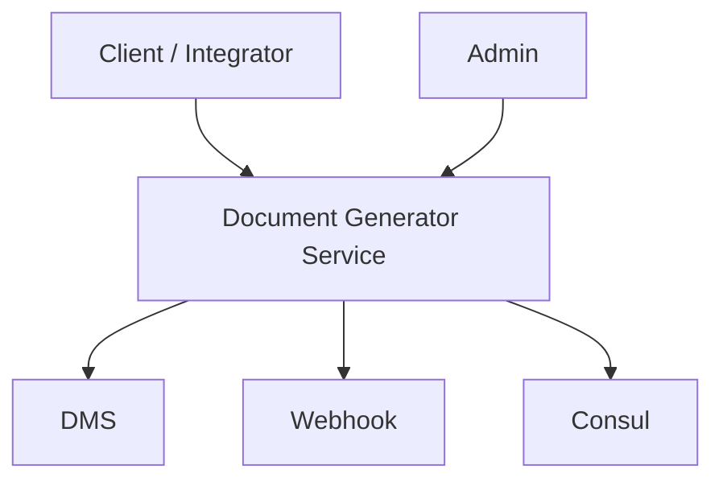
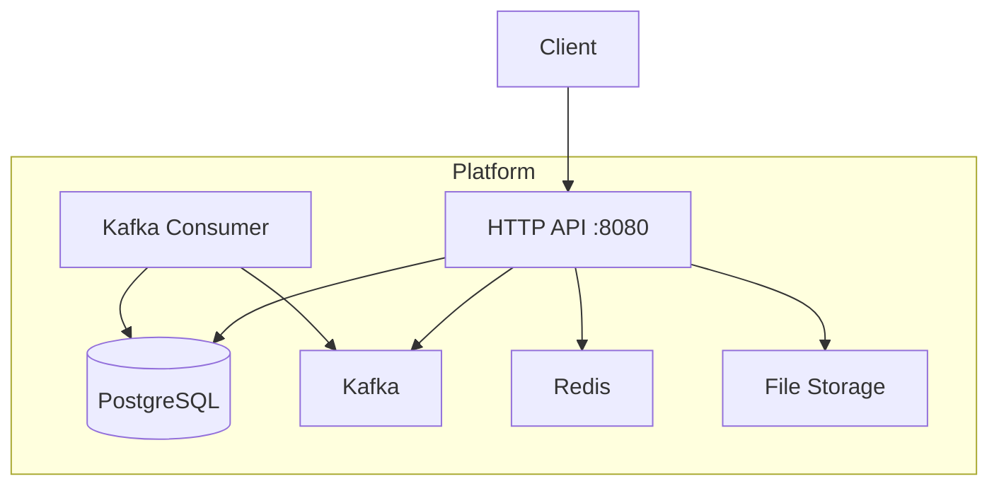
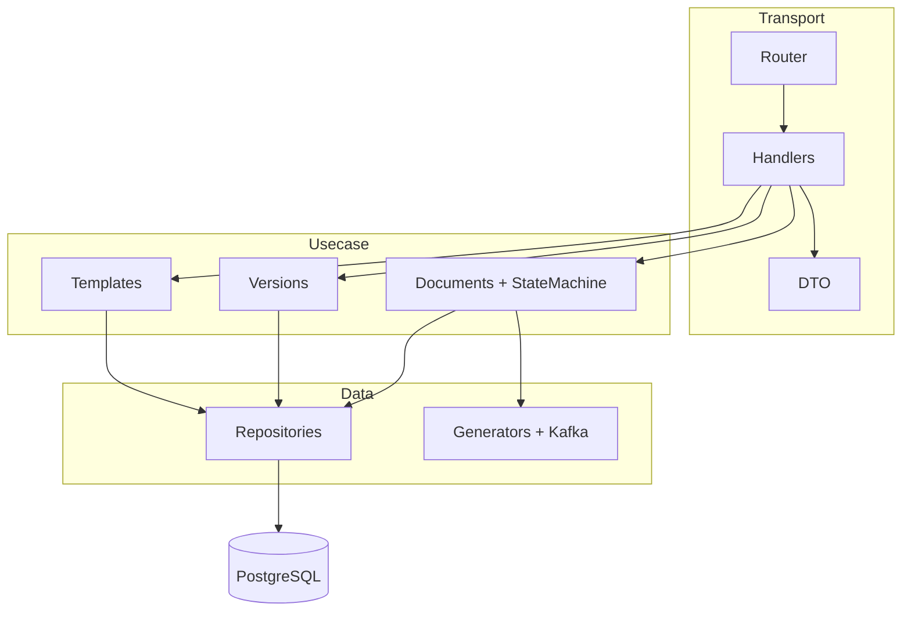

# C4 Model — All Levels Summary

Quick reference page for C1–C4 of the **go-document-generator** project.

## C1 — System Context

Details: [c1-system-context.md](./c1-system-context.md)

---

## C2 — Containers

Details: [c2-containers.md](./c2-containers.md)

---

## C3 — Components (summary)

Details: [c3-components-api.md](./c3-components-api.md) · [c3-components-domain.md](./c3-components-domain.md)

---

## C4 — Code (Documents)

Core packages: `usecase/documents` + `states/` + `transitions/`.

Details: [c4-code-documents.md](./c4-code-documents.md)

---

## Level Navigation

| Level | Questions answered | File |
|-------|-------------------|------|
| **C1** | Who uses the system? | [c1-system-context.md](./c1-system-context.md) |
| **C2** | What gets deployed? | [c2-containers.md](./c2-containers.md) |
| **C3** | What modules are inside the API? | [c3-components-api.md](./c3-components-api.md) |
| **C3** | How does the state machine work? | [c3-components-domain.md](./c3-components-domain.md) |
| **C4** | Which classes/files? | [c4-code-documents.md](./c4-code-documents.md) |
