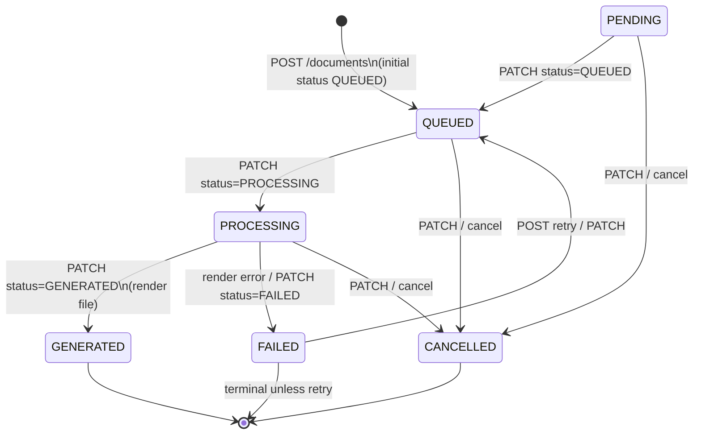
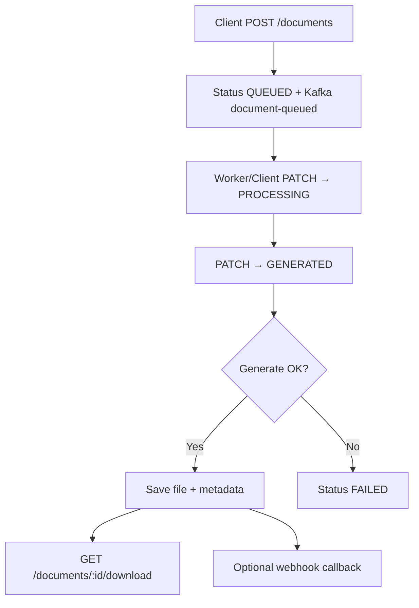

# Document Status Flow (State Machine)

The state machine follows the pattern in `internal/usecase/sample/states` and the PostgreSQL enum `document_status`.

## State Diagram

## Transition Rules

| From | To | How | Handler |
|------|-----|------|---------|
| PENDING | QUEUED | PATCH | `OnToQueued` |
| QUEUED | PROCESSING | PATCH | `OnToProcessing` |
| PROCESSING | GENERATED | PATCH | `OnToGenerated` (+ generate) |
| PROCESSING | FAILED | generate error / PATCH | `OnToFailed` |
| *active* | CANCELLED | PATCH / POST cancel | `OnToCancelled` |
| FAILED | QUEUED | POST retry | `OnRetry` |
| PENDING/QUEUED | (fields) | PATCH without status change | `OnFieldUpdate` |

**Field patches** (`payload`, `metadata`, `callback_url`, …) are only allowed when status is **PENDING** or **QUEUED**.

## Typical Operational Flow

## Terminal Statuses

| Status | PATCH behavior |
|--------|----------------|
| GENERATED | No-op only; no outbound transitions |
| CANCELLED | Terminal |
| FAILED | Retry only → QUEUED |
