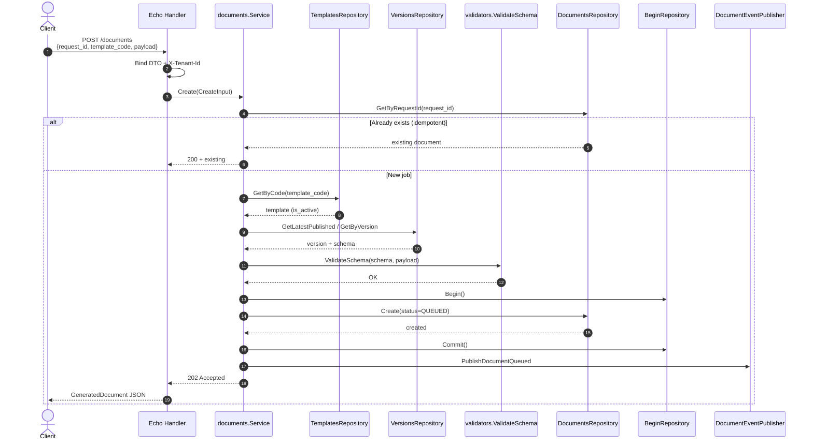

# Sequence — Create Document (POST /documents)

Creates a document generation job with `request_id` as the idempotency key.

## Diagram

## HTTP Responses

| Condition | Status |
|-----------|--------|
| New job | `202 Accepted` |
| `request_id` replay | `200 OK` |
| Template not found / not published | `404` |
| Invalid payload schema | `400` |

## Side Effects

- Row in `documents` table with status **QUEUED**
- Kafka event on `document-events` (key = `request_id`)
