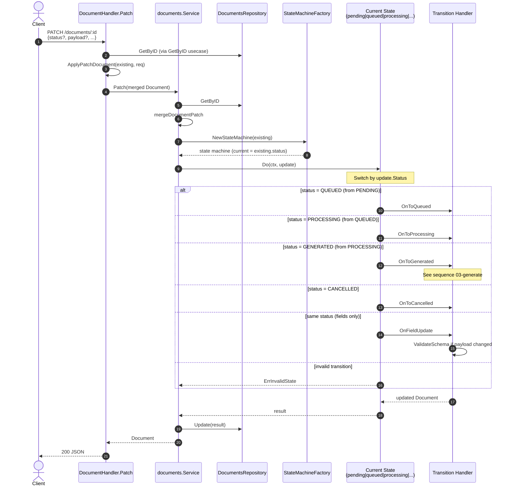

# Sequence — PATCH Document & State Machine

Partial field updates and/or sequential status transitions.

## Diagram

## Validation

- Status transitions must be **sequential** (see [document-status-flow.md](../flows/document-status-flow.md)).
- Field patches are rejected when status is not PENDING/QUEUED (unless a status transition is also requested).
