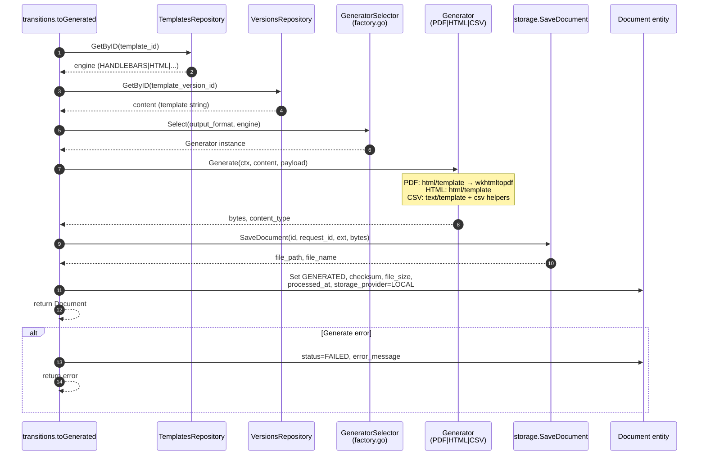
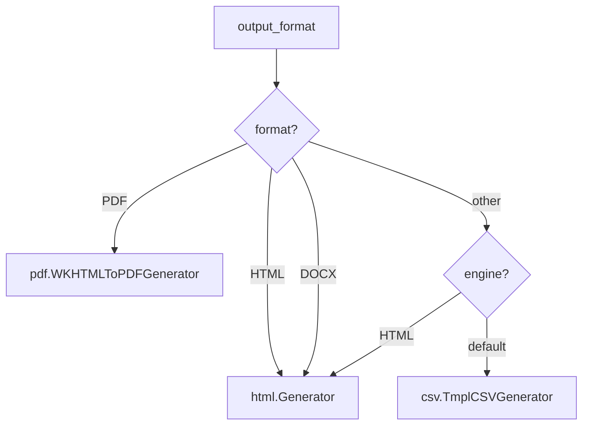

# Sequence — Generate Document (PROCESSING → GENERATED)

Executed inside the `OnToGenerated` transition when PATCH sets `status: GENERATED`.

## Diagram

## Generator Selection

## Output File

Path: `./storage/documents/{document_id}/{request_id}.{ext}`

Download: `GET /documents/:id/download` → redirect to `file_path`.
