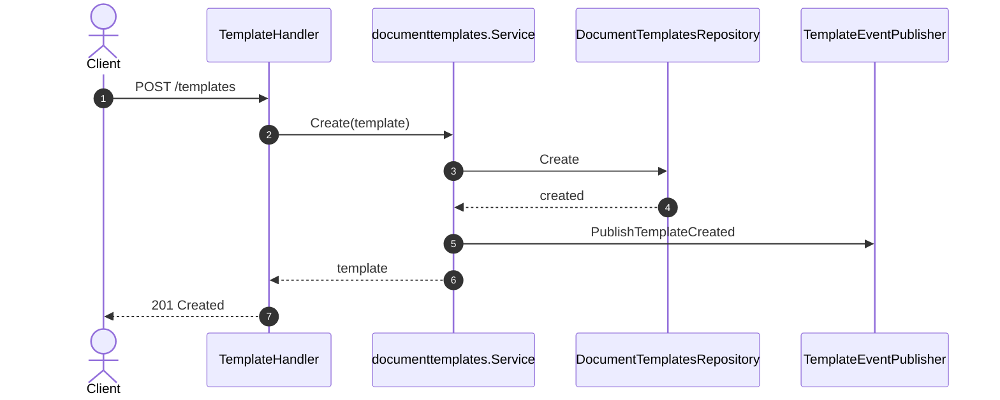
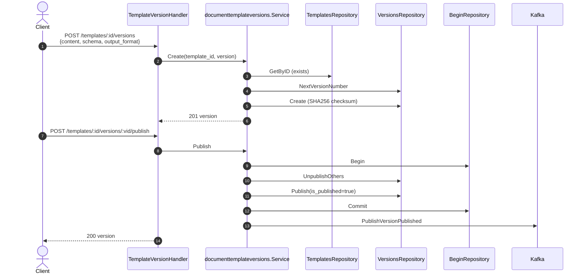
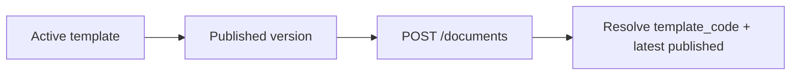

# Sequence — Template Management & Versions

Master template and versioning flow before documents can be generated.

## 4.1 Create Template

## 4.2 Create & Publish Version

## Prerequisites for Document Generation

`Create` uses the latest **published** version when `template_version` is omitted.
