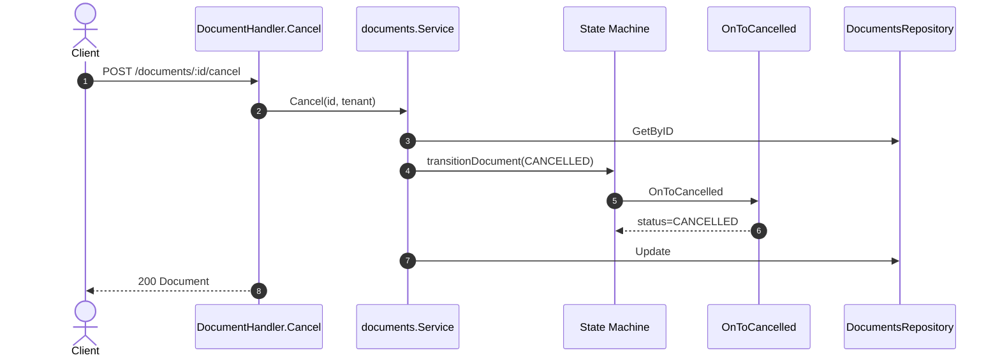
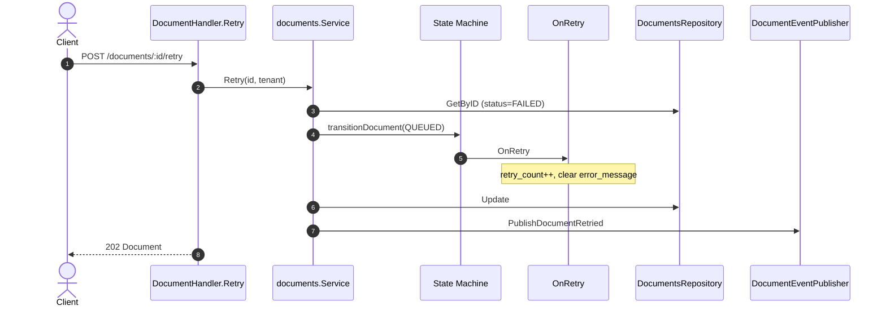

# Sequence — Cancel & Retry Document

## 5.1 Cancel (POST /documents/:id/cancel)

Allowed only from: **PENDING**, **QUEUED**, **PROCESSING**.

## 5.2 Retry (POST /documents/:id/retry)

## Comparison

| Action | Initial status | Final status | Kafka |
|--------|----------------|--------------|-------|
| Cancel | PENDING/QUEUED/PROCESSING | CANCELLED | — |
| Retry | FAILED | QUEUED | document-retried |
