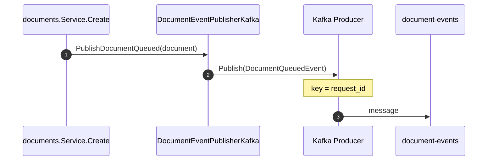
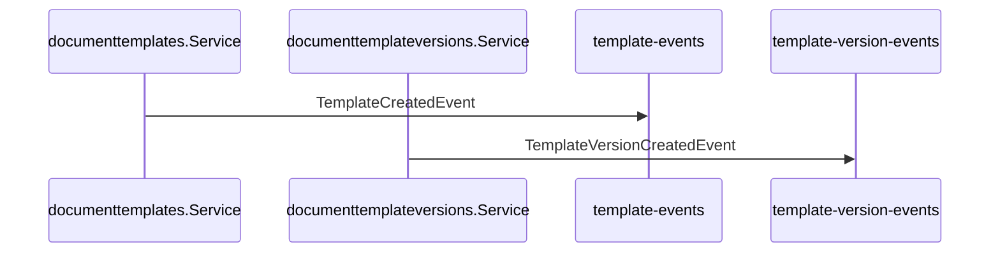
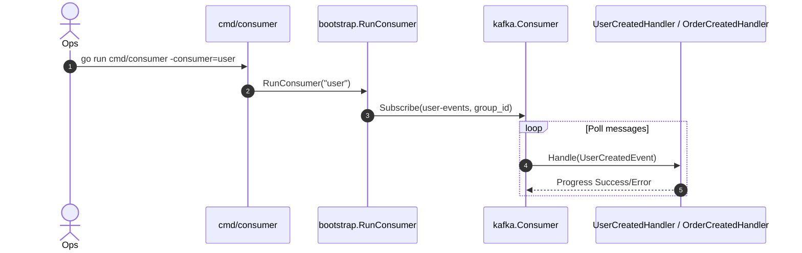
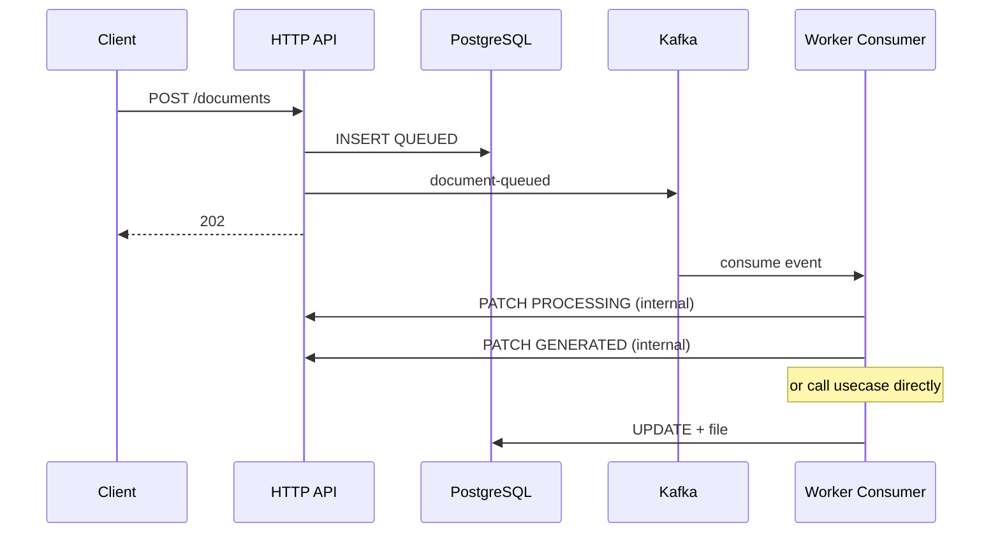

# Sequence — Kafka Events

Event-driven integration for downstream notifications and example consumers.

## Topics (config)

| Topic | Producer | Payload |
|-------|----------|---------|
| `user-events` | User create/update | `UserCreatedEvent` |
| `template-events` | Template create/update | `TemplateCreatedEvent` |
| `template-version-events` | Version create/publish | `TemplateVersionCreatedEvent` |
| `document-events` | Document queued/retried | `DocumentQueuedEvent`, `DocumentRetriedEvent` |

## Publish — Document Queued

## Publish — Template / Version

## Consumer (examples)

> A dedicated document consumer (process QUEUED → PROCESSING → GENERATED) can be added as a separate handler calling `documents.Service` — not wired in the repo yet; the current flow triggers the state machine via the **PATCH API**.

## End-to-End Diagram (target architecture)

